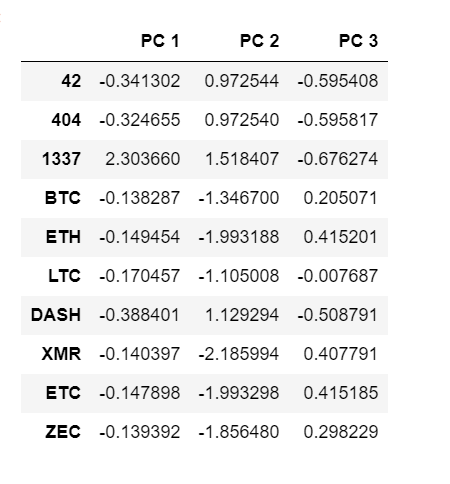
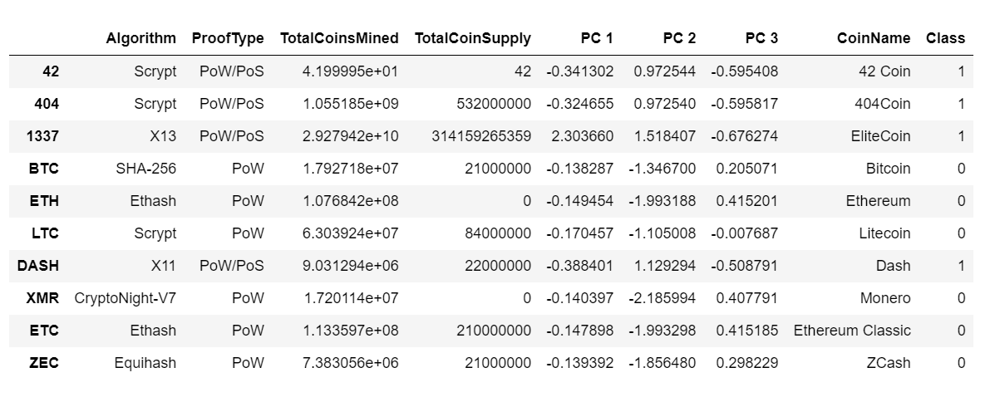
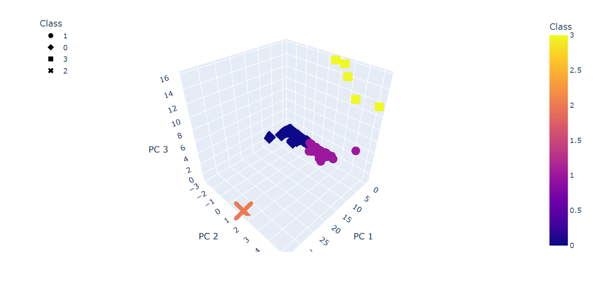
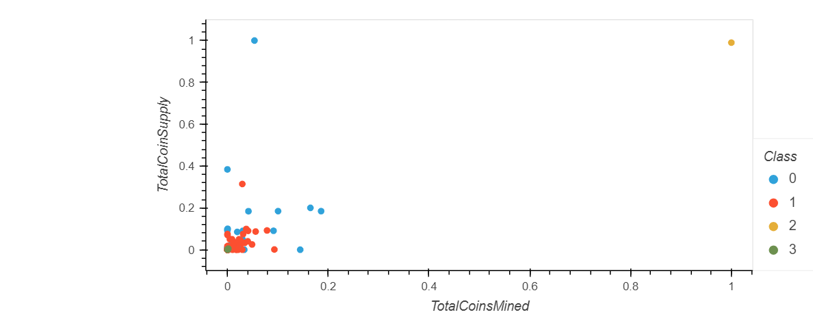

# Cryptocurrencies

## Overview

This project aims to use unsupervised machine learning to analyse cryptocurrency data. The analysis was made on a Jupyter notebook using Python libraries Pandas, Matplotlib, and Scikit learn. PCA was used to reduce data dimensions and K-means to group the data into clusters.

## Results

- First, data were preprocessed to remove null values and unnecessary columns. Also, get_dummies was applied to string columns to convert them into numeric ones, that could be used by the machine learning method. Lastly, StandardScale was used to normalize the data.
- Then, the PCA method reduced data dimensions to 3 components

- The elbow curve chart was created to identify the number of clusters

- The method Kmeans was applied with 4 clusters as a parameter. Both PCA and Kmeans results were merged in a new data frame.

- Clusters were plotted in a 3D Scatter plot

- Finally, a new scatter plot was created, showing the relationship between total coins mined and total coins supply.

